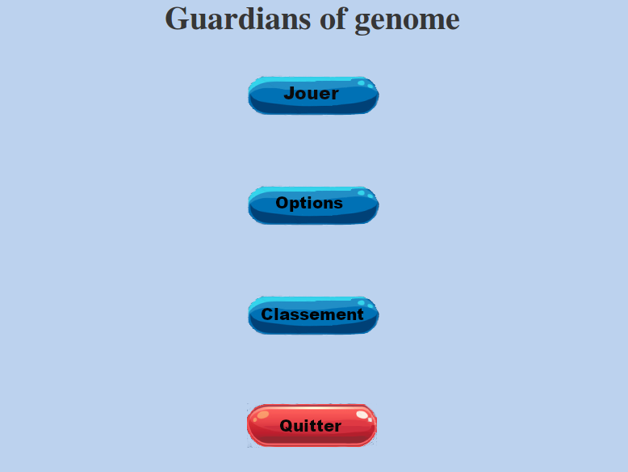
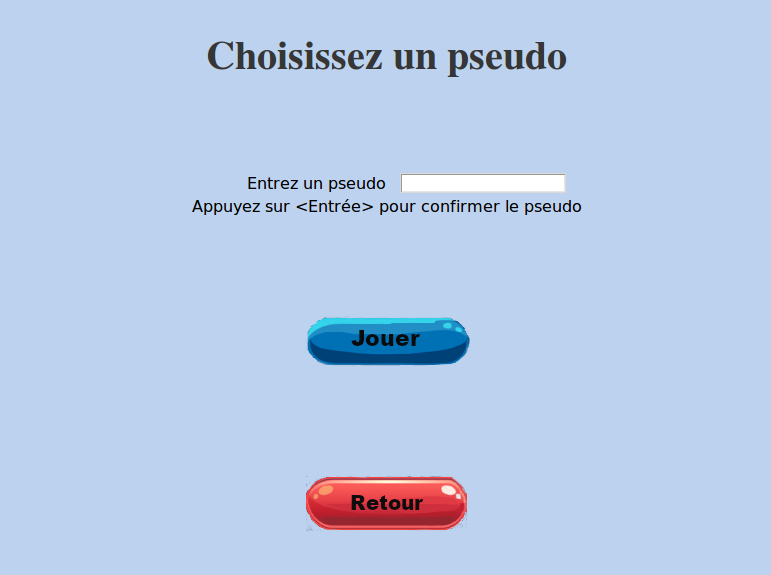
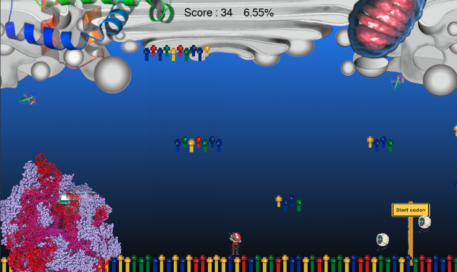
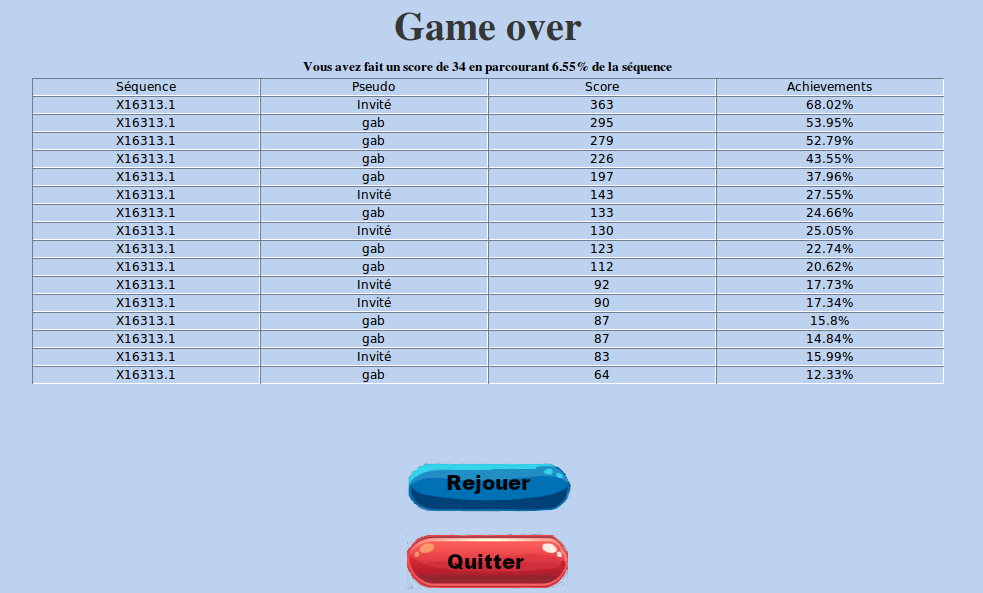

Guardians of Genome - Bioinformatic version of Mario Bros

---------------------------------------------------------
---------------------------------------------------------

Authors : Arnaud Liehrmann, Yassine Ajlil, Alexandre Gestin and Gabriel Pires

This video game has 7 python scripts : 
	
 - Intro : Displays the intro with music
 - Main : Creates the environment
 - Menu :  Creates the Game menu (settings, play, how to play)
 - Settings : A file with all constant parameters
 - Sprites : Import the different element of the game
 - Rank : Creates the rank board where you can see your rank
 - Game\_over : Creates the Game over screen with rank

Furthermore, you can import your own RNA-seq (GenBank format) in order to play with it.

How to play : 
	The objective is to reach the end of the RNA sequence before the Ribosome or nanobots touches you.  
	
	
Packages used : 
 - tkinter
 - pygame
 - Biopython
 - collections

A little look at the game interface : 

 

